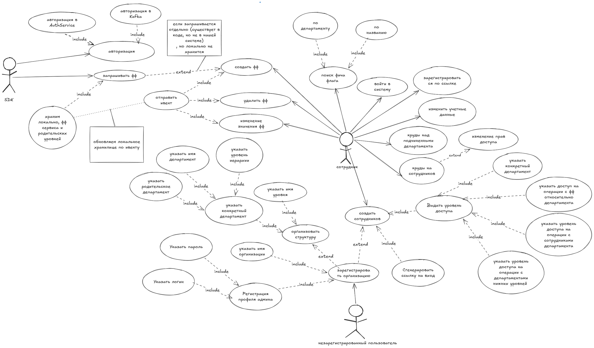

# RED FLAGS
RedFlags — это SaaS-платформа для централизованного управления включением
и отключением функций в приложениях во время его работы (система управления фича-флагами).

Система включает в себя:
- Админ панель, для настройки структуры организации, создания и выдачи 
доступа сотрудникам, переключения фича-флагов (расположена в этом репозитории)
- SDK для клиентских приложений (хранится по [ссылке](https://github.com/RedFlagss/feature_flag_client))

Frontend хранится по [ссылке](https://github.com/RedFlagss/frontend-workshop)

# Стек технологий
Админ панель состоит из 2 микросервисов:

- Сервис авторизации: Java 21, Micronaut, PostgreSQL, Redis, Kafka
 - Основной сервис: Java 21, Micronaut, Kafka, PostgreSQL

Для микросервисов админ панели настроено хранение логов и сбор метрик: Grafana Alloy, Loki, Prometheus, Grafana

SDK для клиентских приложений: Java 17, Kafka
Frontend: TS, React, next.js, scss, casl, antd

# Документация
## Архитектура

Микросервисы админ панели:
- Auth service - сервис авторизации. Работает с сессиями для ui пользователей,
с jwt токенами для клиентов-сервисов; выдает доступы к kafka
- Feature-flag service - основной сервис. Сервис отвечает за работу с 
фича-флагами, организациями и звеньями организации.
Звенья образуют древовидную структуру организации, которая хранится как ltree дерево

SDK для клиентских приложений: 

SDK отвечает за интеграцию фича-флагов в клиентский сервис, 
автоматическое получение актуальных значений флагов и синхронизацию 
изменений в реальном времени через Kafka.

## UseCase - диаграмма

# Развертывание
Для запуска админ панели необходимо запустить контейнеры docker через
docker-compose.

Логи и метрики не собраны в image docker, поэтому для запуска с ними
необходимо собрать микросервисы локально, изменив docker-compose из 
ветки master. Настроенный docker-compose для сборки микросервисов 
с логами и метриками находится в ветке logi. Перед его сборкой необходимо
собрать микросервисы через gradle.

SDK запускается отдельным проектом

# Работяги:
[Лиза Антипатрова](https://github.com/LizaAntipatrova) - java-developer, devOps engineer

[Семен Муравьев](https://github.com/SemionMur) - java-developer

[Ирина Хрусталева](https://github.com/rubberPlant256) - java-developer

[Кирилл Авдеев](https://github.com/DischargedRobot) - frontend-developer

[Дима Бряков](https://github.com/razondark) - Mentor

Т-банк зимняя проектная мастерская, март-апрель 2026

