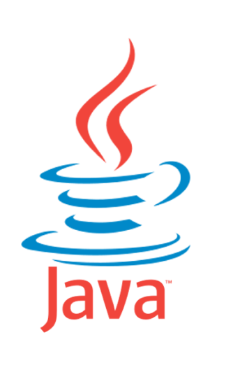
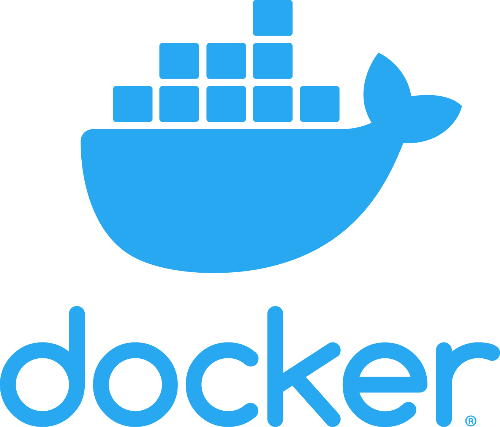
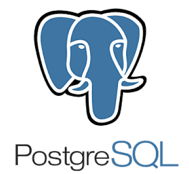
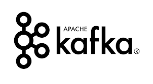
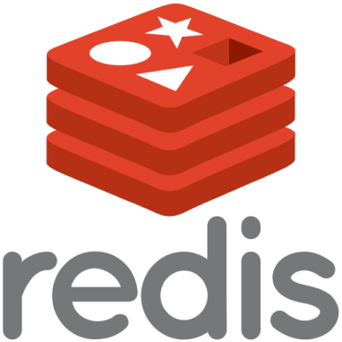
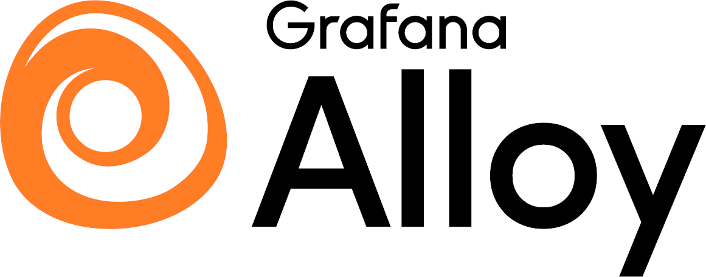
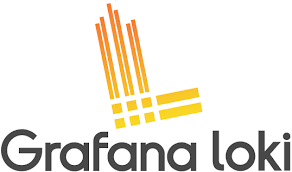
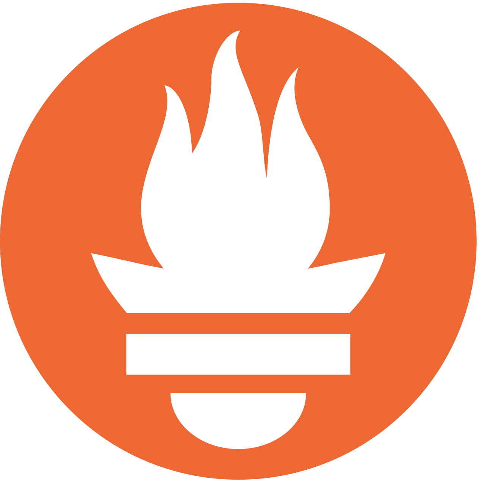
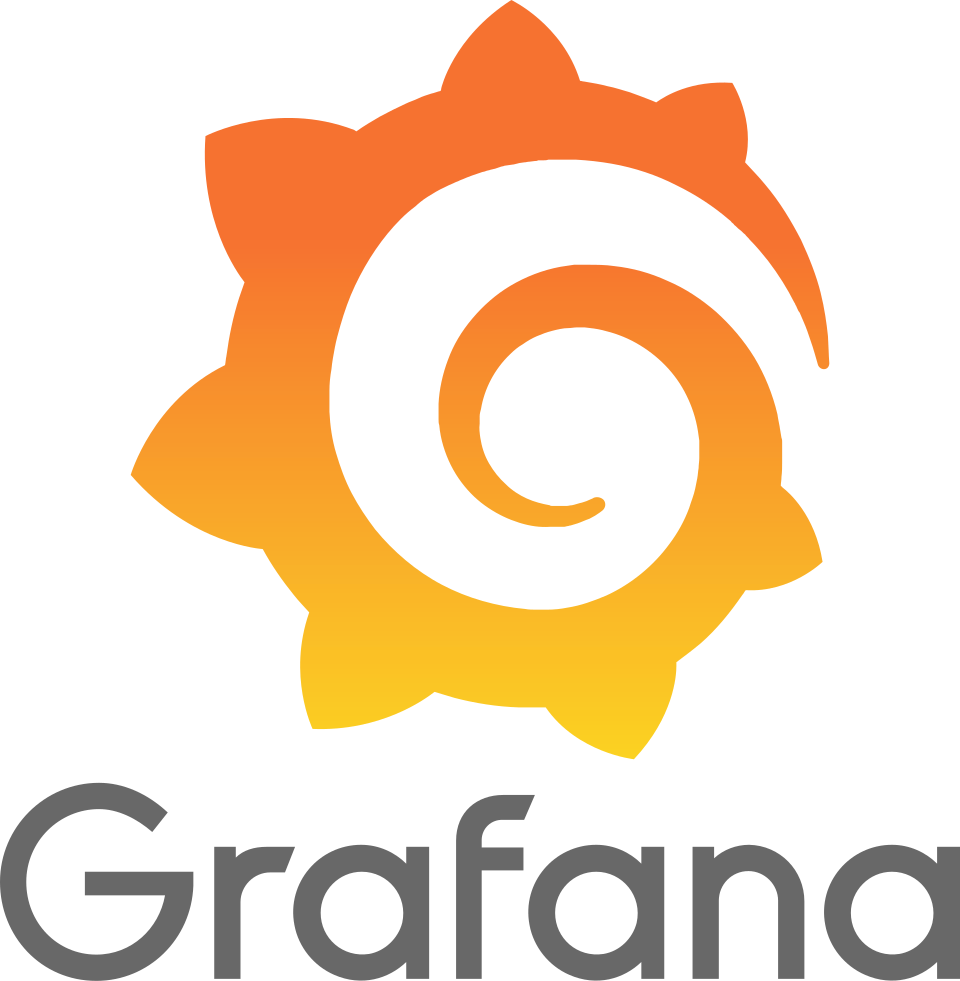
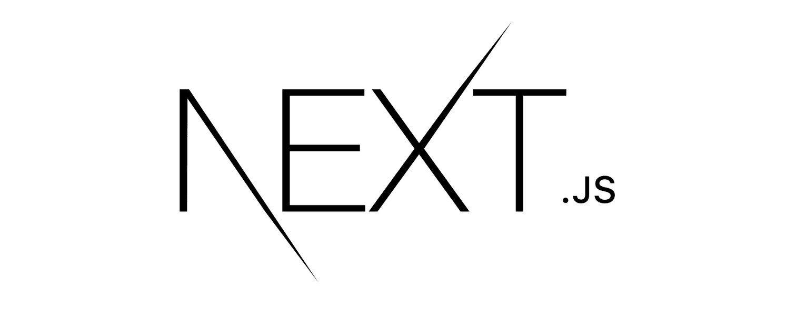

# RedFlags

> Этот репозиторий — форк бекенд-части командного проекта [RedFlags](https://github.com/RedFlagss).  
> Ниже дано общее описание проекта и мой вклад в этот проект.

RedFlags — SaaS-платформа для централизованного управления фича-флагами.

Потребитель управляет флагами через UI, а клиентские приложения получают изменения через Kafka и применяют их через SDK.

Система состоит из нескольких компонентов:

- **Сервис авторизации** — отвечает за аутентификацию и авторизацию ui-пользователей и sdk-клиентов, также управляет доступом в Kafka через Kafka Admin;
- **Сервис feature flags** — отвечает за хранение, изменение и получение фича-флагов, узлов организации и самих организаций (моя зона ответственности);
- **SDK для клиентских приложений** — предоставляет интерфейс для получения актуальных значений флагов через Kafka и интеграцию с сервисом фича-флагов;
- **Frontend** — UI для управления системой;

Связанные репозитории:
- [SDK для клиентских приложений](https://github.com/RedFlagss/feature_flag_client)
- [Frontend](https://github.com/RedFlagss/frontend-workshop)
- [Original repository](https://github.com/RedFlagss/feature_flag_main)

## Стек технологий проекта
### Backend

 

### Логи и метрики
 

 

### Frontend
 

## Важно: это fork

Этот репозиторий является форком проекта RedFlags:

Original team:
- [Лиза Антипатрова](https://github.com/LizaAntipatrova) - java-developer, devOps engineer
- [Семен Муравьев](https://github.com/SemionMur) - java-developer
- [Ирина Хрусталева](https://github.com/rubberPlant256) - java-developer
- [Кирилл Авдеев](https://github.com/DischargedRobot) - frontend-developer
- [Дима Бряков](https://github.com/razondark) - Mentor

### Зачем этот fork у меня

Я была участником команды разработки этого проекта.  
Этот форк я использую, чтобы зафиксировать и показать свою зону ответственности и личный вклад в backend-часть и развёртывание системы.

## Мой вклад

Мои основные зоны ответственности в проекте:
- микросервис feature flags,
- проектирование архитектуры системы,
- развёртывание системы.

### Что сделала лично я
- [Архитектура  системы](./docs/schemas/architecture.md)
- [Схема БД для микросервисов авторизации и фича-флагов](./docs/schemas/db.md);
- CRUD для сущностей `FeatureFlag`, `OrganizationNode` и `Organization`;
- Операции над ltree деревом сущности `OrganizationNode`;
- OpenAPI-спецификацию для микросервиса фича-флагов;
- Настроила Kafka Producer для публикации изменений фича-флагов;
- Реализовала ограничения доступа на уровне контроллеров и на сервисном уровне. На сервисном уровне доступы ограничиваются положением авторизованного пользователя в древовидной структуре;
- Подготовила docker-compose для локального запуска системы;
- Настроила API Gateway для маршрутизации запросов между сервисами.;
- Развернула проект на локальной машине с пробросом портов на VPS через frp;
- Настроила роутинг домена к порту сервера фронтенда и поддомена api к порту API Gateway через nginx на VPS
- Выпустила два TLS-сертификата для основного домена и поддомена API.

### В чем я учавствовала
- Описание функциональности системы
- Настройка Kafka и Kafka Admin для динамического создания топиков, учетных данных и ACL;

